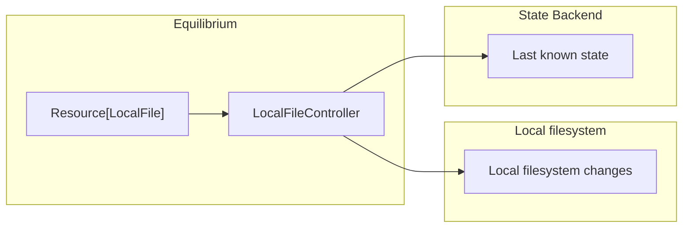

# equilibrium

> __Equilibrium__ _(noun)_: A state in which opposing forces or influences are balanced, resulting in a stable system
> that does not undergo significant changes. In a broader sense, equilibrium can refer to a state of mental or emotional
> balance, as well as the balance of forces in physical or chemical systems.

Equilibrium is a framework for implementing control loops and is heavily Kubernets-inspired. A control loop is a
system that continuously monitors the state of a system and takes action to bring the system into a desired state.
It is designed to be extensible and flexible, allowing you to implement control loops that are tailored to your
specific use case.

__Installation__

Equilibrium is available on PyPI. You need at least Python 3.10.

```bash
pip install python-equilibrium
```

__Example__

Check out the [examples/local_file/](examples/local_file/) directory for a simple example of a control loop that
monitors a local file and takes action when the file is modified.



__Difference to Kubernetes resources__

* Equilibrium does not currently support any key other than `spec` next to `apiVersion`, `kind`, and `metadata` in
  a resource definition. This means Equilibrium cannot be used to deserialize actual Kubernetes `Secret` of `Config`
  resources.
